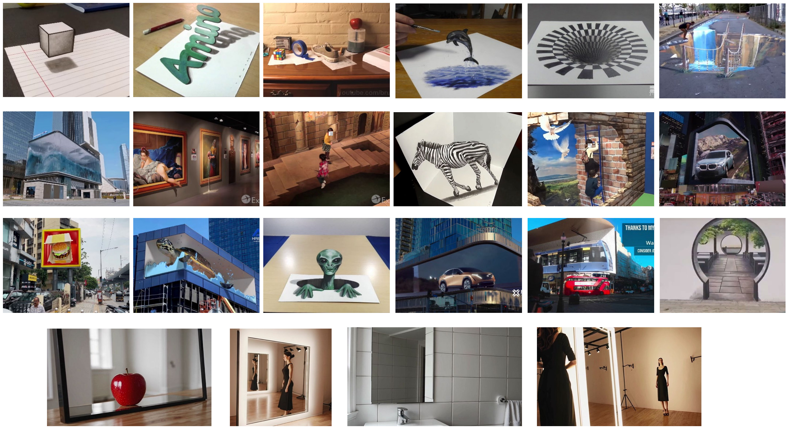
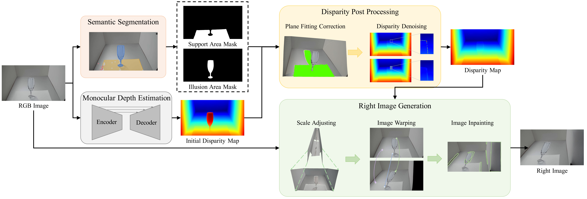
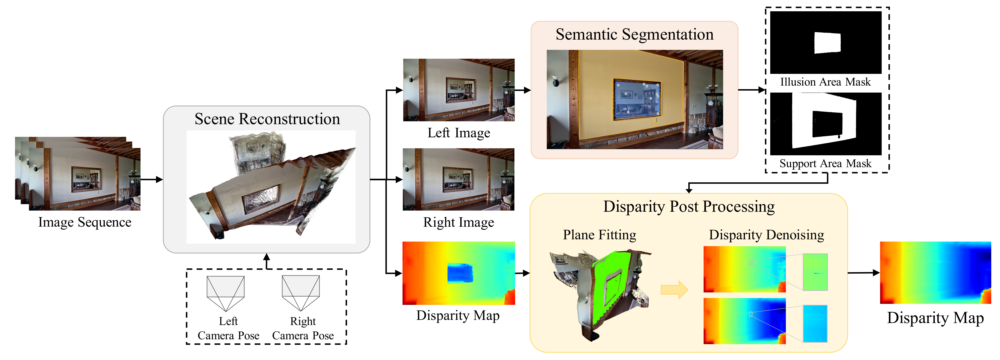
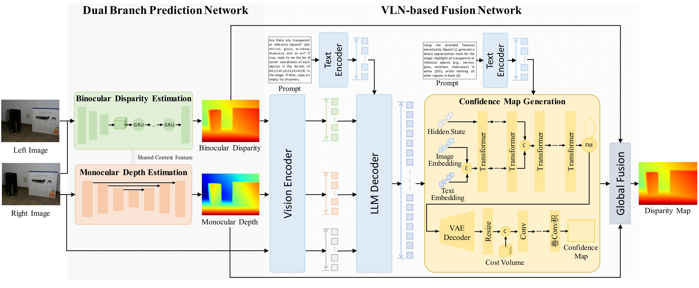
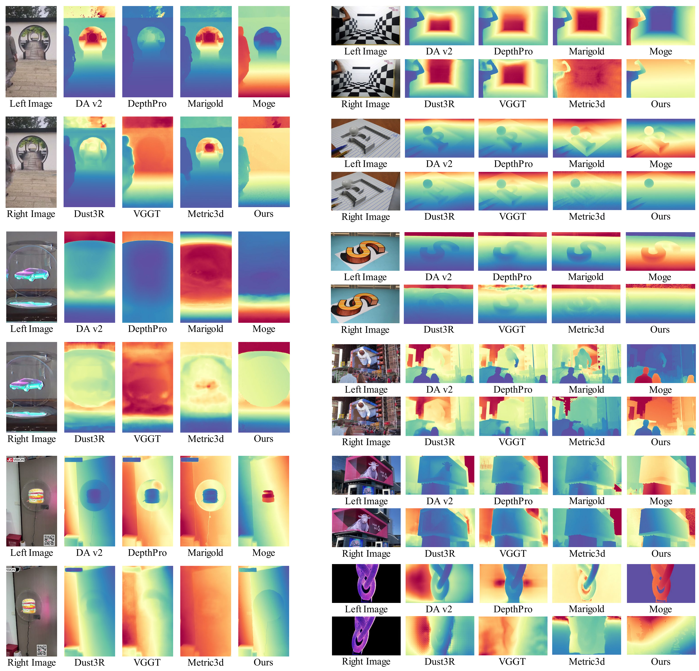
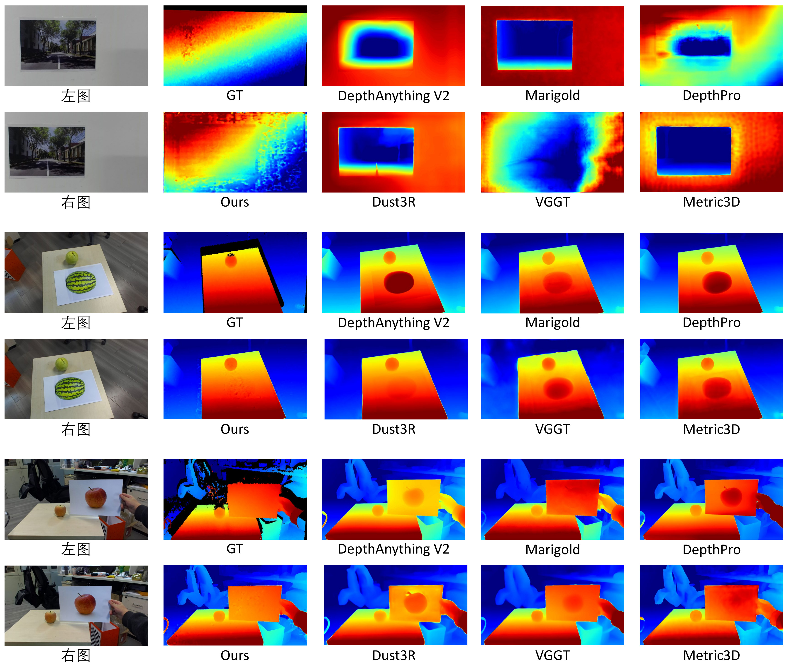
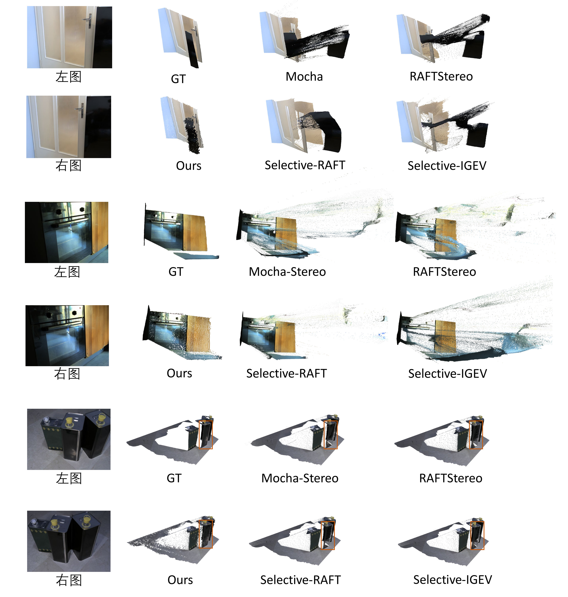
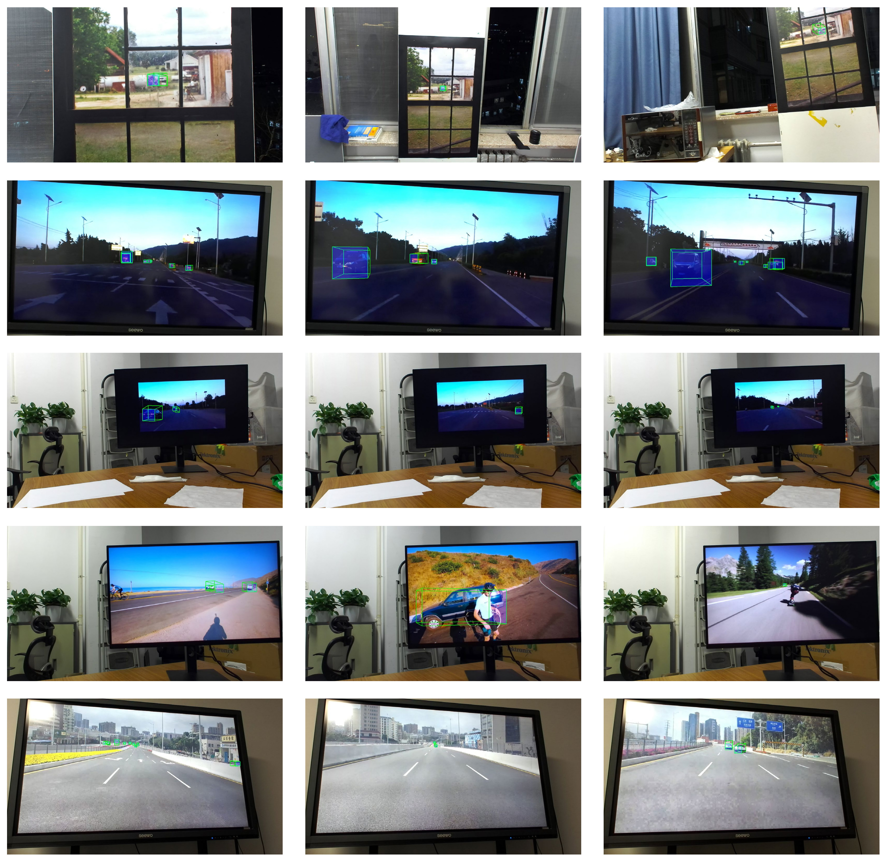

<h1 align="center"> 3D Visual Illusion Depth Estimation </h1> 

  
  &nbsp;
  
  &nbsp;
  

- ## StereoSimulator
    Pipeline used to generate stereo data with videos from web or generative model

    <figure style="text-align: center;">
    
    <figcaption style="font-style: italic; margin-top: 8px; text-align: center;">Data generation pipeline for web-source data</figcaption>
    </figure>

    <figure>
    
    <figcaption style="text-align: center; font-style: italic; text-align: center;">Data generation pipeline for videos from generative models</figcaption>
    </figure>

- ## VLM-driven Mon-Stereo Fusion
    The VLM-driven monocular-stereo fusion model

    <figure style="text-align: center;">
    
    <!-- <figcaption style="font-style: italic; margin-top: 8px;">Data generation pipeline for web-source data</figcaption> -->
    </figure>

- ## Results
    Results on a part of different illusions

    <figure style="text-align: center;">
    
    <figcaption style="font-style: italic; margin-top: 8px; text-align: center;">Illusions on Generated Data</figcaption>
    </figure>

    <figure style="text-align: center;">
    
    <figcaption style="font-style: italic; margin-top: 8px; text-align: center;">Illusions on Real-world Data</figcaption>
    </figure>

    <figure style="text-align: center;">
    
    <figcaption style="font-style: italic; margin-top: 8px; text-align: center;">Mirror Illusions</figcaption>
    </figure>

    <figure style="text-align: center;">
    
    <figcaption style="font-style: italic; margin-top: 8px; text-align: center;">Illusions in 3D Detection</figcaption>
    </figure>

    More visualizations in 3D lane detection, occupancy prediction, and planning are coming soon.
