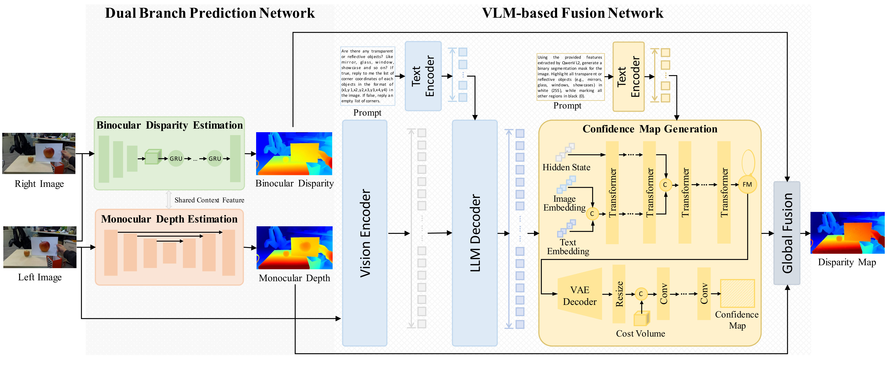

<h1 align="center">3D Visual Illusion Depth Estimation</h1>

  
  &nbsp;
  
  &nbsp;
  
  &nbsp;
  

  

### Notes
- The `depth` files in [VirtualData](https://huggingface.co/datasets/AdamYao/3D_Visual_Illusion_Depth_Estimation), which are used for training, are monocular depth predictions generated by DepthAnythingV2, rather than ground-truth metric depth. Moreover, since the output of DepthAnythingV2 corresponds to the inverse of depth, these depth files can be interpreted as a form of disparity, as described in our paper. We determine appropriate scale factors to enable reasonable warping for right-image generation. Therefore, please use `scale_factors.csv` and `scale_factors_2.csv` provided in VirtualData to rescale the values in the depth files.
- The `disp` files in [RealData](https://huggingface.co/datasets/AdamYao/3D_Visual_Illusion_Depth_Estimation_Real), which are used for evaluation, are collected using Intel RealSense L515 and serve as ground-truth metric disparity. All images have been calibrated and rectified for the stereo camera setup, and no additional processing is required.
- Illusion regions are provided via binary masks. These masks are obtained using SAM + manual annotation, and almost every image contains illusion regions.

<h2 align="center">StereoSimulator</h2>

Pipeline used to generate stereo data with videos from the web or the generative models.

  
   
  <em>Data generation pipeline for web-source data</em>

  
   
  <em>Data generation pipeline for videos from generative models</em>

<h2 align="center">VLM-driven Mon-Stereo Fusion</h2>

The VLM-driven monocular-stereo fusion model.

  

<h2 align="center">Results</h2>

  Results on different illusions.  
  A part of the demo images can be downloaded from 
  <a href="https://drive.google.com/file/d/163pjMDnZnO2V4DeiKOpQD4KYP7_Us4j0/view?usp=sharing">Google Drive</a>.

  
   
  <em>Illusions on Generated Data</em>

  
   
  <em>Illusions on Real-world Data</em>

  
   
  <em>Mirror Illusions</em>

We provide illusion masks in our dataset and encourage their use and extension to other 3D tasks, such as 3D detection.

  
   
  <em>Illusions in 3D Detection</em>

  More visualizations in 3D lane detection, occupancy prediction, and planning are coming soon.

